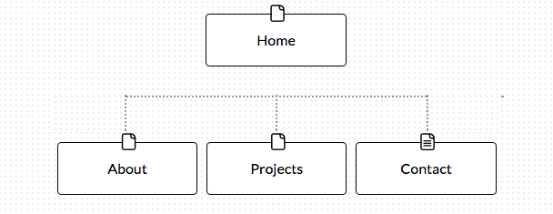

#Design Reflection

#Questions and responses

## What are the 6 Phases of Web Design?
The 6 phases of web design are:
Information Gathering
Planning
Design 
Development
Testing and Delivery
Maintenance

## What is your site's primary goal or purpose? What kind of content will your site feature?
The primary goal of my website is to display the work I've done, convery my skills, and provide contact information. 

## What is your target audience's interests and how do you see your site addressing them?
My target audience is an employer that is interested in learning more about my skills and whether I would be a good fit for their company. My site includes my previous work history as well as current and pas projects. 

## What is the primary "action" the user should take when coming to your site? Do you want them to search for information, contact you, or see your portfolio? It's ok to have several actions at once, or different actions for different kinds of visitors.
The desired action for visitors is to view my work/projects then contact me. 

## What are the main things someone should know about design and user experience?
I think the most important things someoneone should know about design and user experience are (1) understanding the purpose of your website, (2) understanding your target audience, and (3) understanding that user-centric design improves user engagement.  

## What is user experience design and why is it valuable? 
User exerience, or UX, is the feeling a visitor gets when interfacing with a website, web application, or desktop software. UX design is the process of developing a website with user-centric design that ensures the experience is pleasant and efficient. With the number of Web-users reaching 1.5 billion is 2008, more varied methods of accessing the web, and the development of more sophisticated websites, UX design maintains a pleasant, efficient, and and acessible experience.  	 

## Which parts of the challenge did you find tedious?
I didn't find any parts of this challenge particularly tedious.
