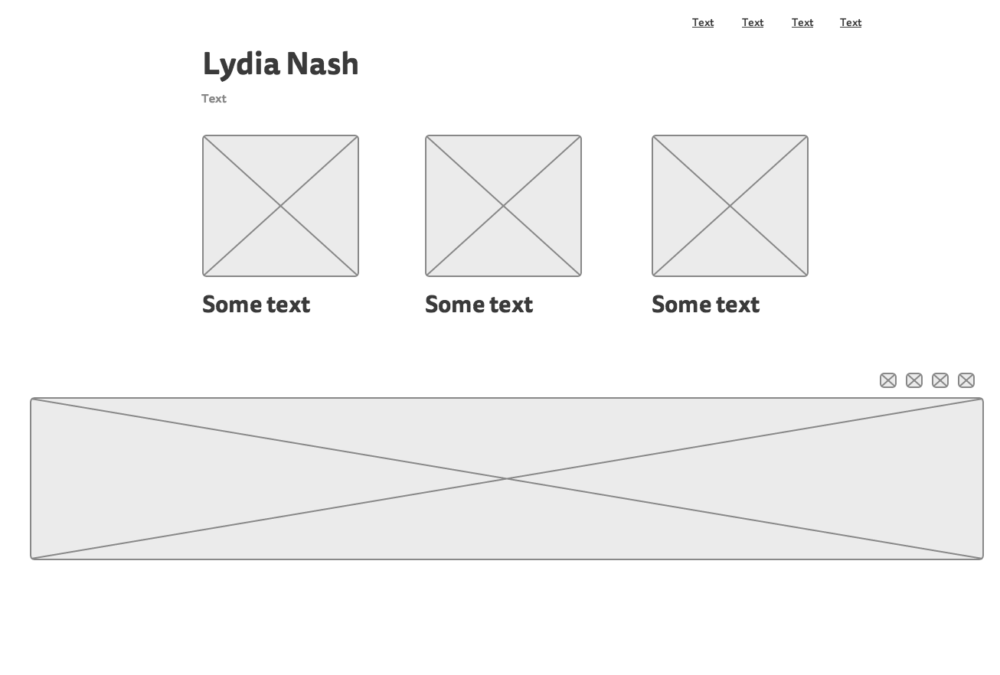
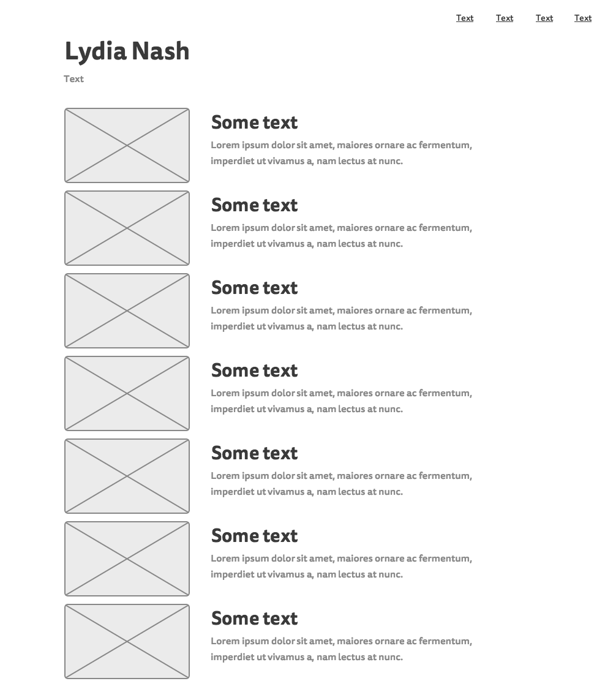

Main site index wireframe:

Blog index wireframe:

## What is a wireframe?
A wireframe is a visualization of the main structure, functionality, and layout of a web page without including any content or design elements such as font or colors. This allows designers and engineers an opportunity to assess a website's layout and funcitonality at its simplest form without design distractions.

## What are the benefits of wireframing?
Wireframing allows the creator to see the general layour of the website and its usbaility before adding content and implementing more nuanced design decisions like font, colors, etc.

## Did you enjoy wireframing your site?
Yes! It was fun and was a nice opportunity to think creatively.

## Did you revise your wireframe or stick with your first idea?
I stuck with my first idea, but I imagine, I will rearrange in the future!

## What questions did you ask during this challenge? What resources did you find to help you answer them?
I didn't have any questions during this exercise.

## Which parts of the challenge did you enjoy and which parts did you find tedious?
I enjoyed thinking through the layout of my website the most! The tedious part was just lining everything up in the wireframing program.

