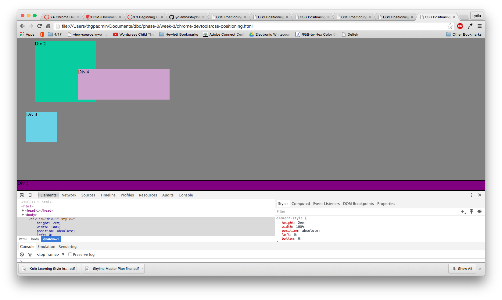

# Reflection Questions

** How can you use Chrome's DevTools inspector to help you format or position elements?
Since your changes are displayed in real time, it is quick and easy to see your CSS adjustments.

** How can you resize elements on the DOM using CSS?
By adjusting the height and width in the element.style box on the right. Alternately, you can adjust them in the box model. 

** What are the differences between absolute, fixed, static, and relative positioning? Which did you find easiest to use? Which was most difficult?
Static positioning allows the element to use its normal behavior -- it is not impacted by top, left, right, bottom, and z-index properties. Relative adjusts the element's position without changing the rest of the layout whereas absolute positioning allows you to control the exact location of your element on the page, by specifying top, left, right, and bottom. Fixed positioning does not move when scrolled. 

** What are the differences between margin, border, and padding?
Padding is the space between the element and its border. The border is the perimeter of the padding of the element. The margin is the space between the border and the page (or the nearest element). 

** What was your impression of this challenge overall? (love, hate, and why?)
This challenge was pretty painful. One small mistake can disrupt the layout on the entire page. That being said, we were able to get through the layouts pretty well, except for 3.4.8, which we finished but I don't think we used best practices. 

# Screenshots

