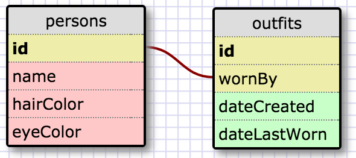

# RELEASE 5 - Selecting

1. SELECT * FROM states;
2. SELECT * FROM regions;
3. SELECT state_name, population FROM states;
4. SELECT state_name, population FROM states 
   ORDER BY population DESC;
5. SELECT state_name FROM states
   WHERE region_id = 7;
6. SELECT state_name, population_density from states 
   WHERE population_density > 50
   ORDER BY population_density ASC;
7. SELECT state_name FROM states
   WHERE population BETWEEN 1000000 and 1500000;
8. SELECT state_name, region_id FROM states
   ORDER BY region_id ASC;
9. SELECT region_name FROM regions
   WHERE region_name LIKE "%Central%";
10. SELECT region_name, state_name FROM states
   INNER JOIN regions
   ON states.region_id=regions.id
   ORDER BY region_id ASC;

# RELEASE 6 - Clueless Closet

# REFLECTION

## What are databases for?
Databases store information that can be accessed, edited, appended, and modified. Relational databases consist of one or more linked tables.

## What is a one-to-many relationship?
A one-to-many relationship is a relationship where multiple pieces of data map to a singular piece of data. The example that was used in this exercise was states to regions. Many states belong to a region of the country, but only one region belongs to each state. 

## What is a primary key? What is a foreign key? How can you determine which is which?
The foreign key is the field that maps the values of Table A to Table B. The field in Table B that contains the numeric mapping from Table A is the primary key. The table that contains the unique values of the field has the primary key. The table that does not have unique values is the foreign key.  

## How can you select information out of a SQL database? What are some general guidelines for that?
To select information out of a sql database, type "SELECT [name of column] FROM [name of table];" Generally, clauses (or commands) should be written in all caps and segments of code should end with a semi-colon, which is the delimiter in SQL.

