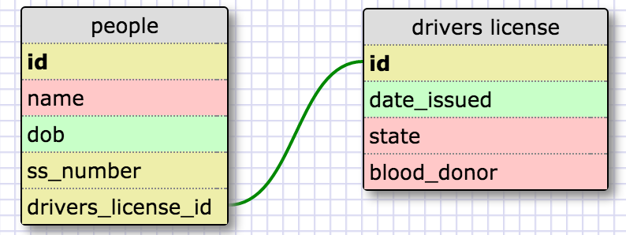
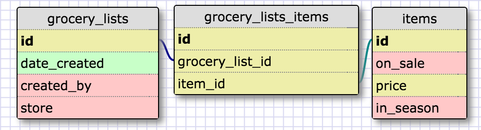

# RELEASE 2: One-to-one Schema

# RELEASE 4: Grocery Lists

# RELEASE 6: Reflection

## What is a one-to-one database?
A one-to-one relationship between two data fields means that the values uniquely map to each other. 

## When would you use a one-to-one database? (Think generally, not in terms of the example you created).
You would use one-to-one db relationship when the fields uniquely map to each other.

## What is a many-to-many database?
A many-to-many relationship between fields means that neither field uniquely maps to values in the other field.  

## When would you use a many-to-many database? (Think generally, not in terms of the example you created).
A many-to-many relationship is used when there one data value maps to many values in another data field, and vice versa. 

## What is confusing about database schemas? What makes sense?
Most of it makes sense so far!
